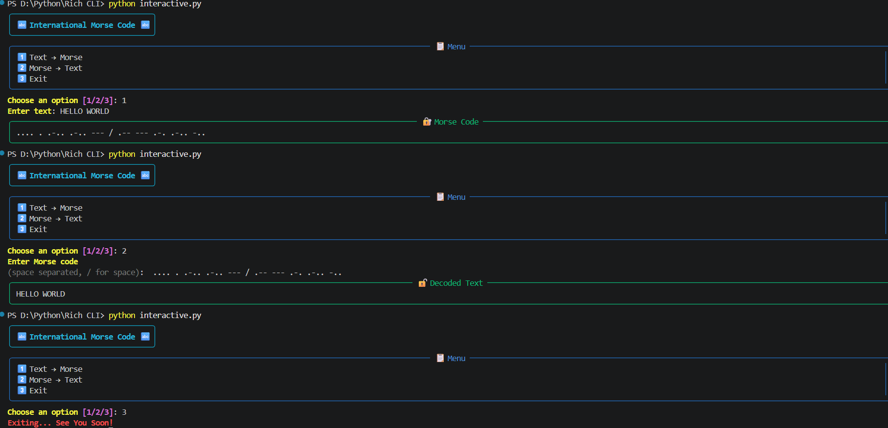

# 🔤 Morse-Decoder-CLI-Lab 🧠

A Python-based **Morse Code Command Line Tool** that allows you to **convert text into International Morse Code and decode Morse code back into readable text.**
This project is designed as a **learning lab** to improve:
- Encoding & decoding logic
- Pattern recognition
- Handling symbol-based communication systems
- CLI tool structuring

It is especially useful for **puzzle solving**, **CTF-style thinking**, and **foundational cybersecurity logic building**.

---

## 🧱 Project Structure

```bash
Morse-Decoder-CLI-Lab/
│
├── assets/             # Screenshots
├── main.py             # Basic CLI application
├── interactive.py      # Rich CLI Version
├── requirements.txt    # Project Dependancies
└── README.md           # Project documentation
```

---

## ✨ Features

### 🔐 Text → Morse Conversion
- Converts **letters**, **numbers**, and **punctuation** into **International Morse Code**
- Uses standard dot (`.`) and dash (`-`) notation
- Represents word gaps using `/`

### 🔓 Morse → Text Decoding
- Decodes space-separated Morse code
- Converts / back into spaces
- Ignores unsupported or invalid sequences safely

### 🧪 Learning-Oriented Design
- Clean dictionary-based mapping
- Easy-to-read conversion logic
- Ideal for experimentation and extension

### 🎨 Rich CLI Interface
- Colored terminal output
- Structured key display tables
- Styled panels for encoding/decoding results
- Better user experience and readability

### ⚡ Dual Mode Support
- 🧼 Basic CLI → Lightweight, no dependencies
- 🎨 Rich CLI → Enhanced UI with colors and panels


---

## 🛠 Technologies Used

| Technology                       | Role                      |
| -------------------------------- | ------------------------- |
| **Python 3**                     | Core programming language |
| **Dictionary Mapping**           | Morse ↔ Text conversion   |
| **CLI (Command Line Interface)** | User interaction          |
| **Rich**                         | Interactive CLI interface |


---

## ▶️ How to Run

### 1️⃣ Clone the repository

```bash
git clone https://github.com/ShakalBhau0001/Morse-Decoder-CLI-Lab.git
```

### 2️⃣ Enter the project directory

```bash
cd Morse-Decoder-CLI-Lab
```

### 3️⃣ Install Dependencies

```bash
pip install rich
```

**OR**

```bash
pip install -r requirements.txt
```

### 4️⃣ Running the Project

#### Basic CLI Version

```bash
python main.py
```

#### Rich Interactive Version

```bash
python interactive.py
```

## ▶️ Usage

After running the program, you will see:

```bash
🔤 International Morse Code 🔤
--------------------
1. Text → Morse
2. Morse → Text
3. Exit
--------------------
```

## 🔐 Text → Morse Example

**Input:**

```bash
HELLO WORLD
```

**Output:**

```bash
.... . .-.. .-.. --- / .-- --- .-. .-.. -..
```

## 🔓 Morse → Text Example

**Input:**

```bash
.... . .-.. .-.. --- / .-- --- .-. .-.. -..
```

**Output:**

```bash
HELLO WORLD
```

---

## ⚙️ How It Works

### 1️⃣ Morse Mapping
- A dictionary maps characters to Morse symbols:
  ```python
  "A": ".-", "B": "-...", "C": "-.-."
  ```

### 2️⃣ Encoding
- Input text is converted to uppercase
- Each character is replaced by its Morse equivalent
- Output is space-separated Morse code

### 3️⃣ Decoding
- Morse input is split by spaces
- Reverse dictionary lookup converts Morse back to text
- `/` is translated back into a space

---

## ⚠️ Limitations
- Morse input **must be space-separated**
- Continuous Morse without spacing is **ambiguous**
- This tool does **not brute-force spacing**
- Not intended for secure communication

---

## 🌟 Future Enhancements
- Auto-spacing / brute-force decoding
- Support for continuous Morse (no spaces)
- File-based input/output
- Morse signal visualization
- Integration with steganography tools

---

## 📦 Extended / Combined Tools

This repository focuses **only on Morse code encoding & decoding** as a **logic-building CLI lab**.

For a **combined and advanced implementation** involving:
- Image steganography
- Audio steganography
- Encrypted payload embedding

please refer to:

> 🔗 **[StegaVault-CLI](https://github.com/ShakalBhau0001/StegaVault-CLI)**

---

## ⚠️ Disclaimer

This project is intended for **educational and learning purposes only**.

Morse code is **not encryption** and should not be used for secure communication.
The goal is to improve **analytical thinking**, **decoding skills**, and **tool-building fundamentals**.

---

## 📸 Preview



---

## 🪪 Author

> **Creator: Shakal Bhau**

> **GitHub: [ShakalBhau0001](https://github.com/ShakalBhau0001)**

---

## ⭐ Support

If you like this project, consider giving it a ⭐ on GitHub!

---
